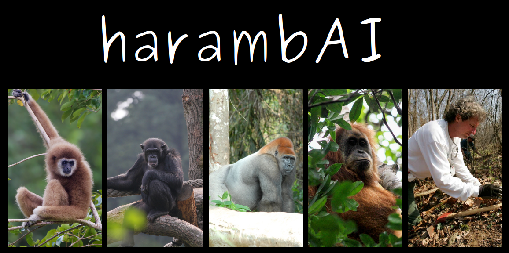
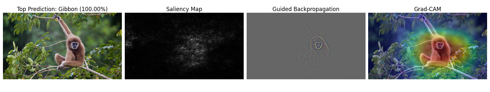
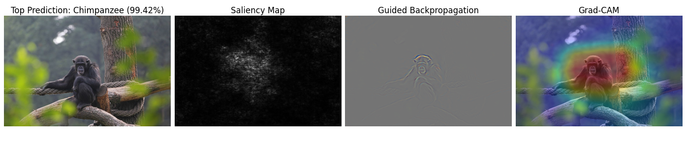
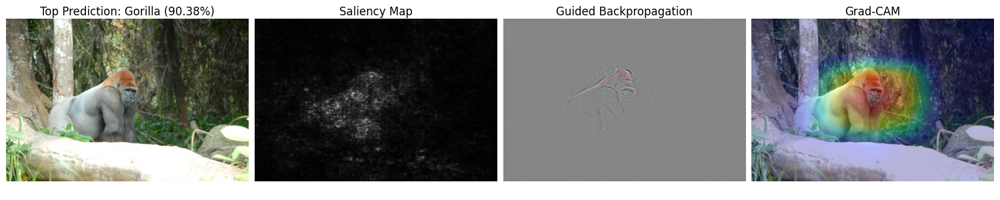
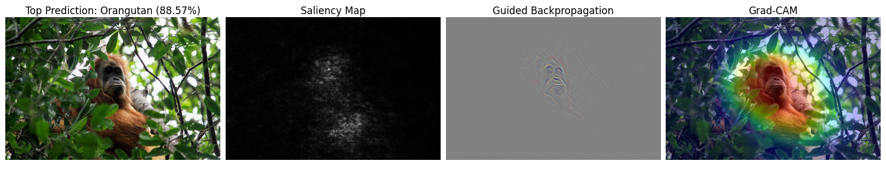
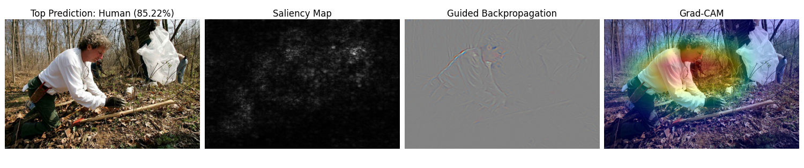

<hr>

Why have a model learn 1000 classes when it can learn just 5? Are we really just 'a notch above chimps'? 

harambAI is a pre-trained PyTorch Resnet50 model that was re-trained for the sole purpose of classifying the Apes:
- Gibbon
- Orangutan 
- Gorilla 
- Chimpanzee/Bonobo (yes I know they aren't exactly the same) 
- Human 

It is trained on a very modest number of images (~2000) for each Ape, so do not to have too high expectations. The purpose of this repo is to implement some visualisation techniques for ConvNets.

harambAI is easy to use. Just give an image link of one of the Apes and choose any of the visualisations below:
- Saliency
- Guided Backpropagation
- Grad-CAM

## Getting Started
#### **Requirements**
- Python 3.+
- Create virtual env (optional)
```
git clone git@github.com:gladwinyjh/harambAI.git
cd harambAI
pip install -r requirements.txt
cd src
```
- For gpu usage, install the appropriate version for your cuda if not already set up. **Running on gpu is not necessary at all.**

#### **Command Line Arguments**
```
-u or --url: Image address of image
    - Accepts most images by 'Copy image address' (Chrome) or 'Copy image link (Firefox)
    - type=str, required=True


-s or --saliency: Option to produce saliency map, defaults to False
    - action='store_true', default=False


-gbp or --guided_backprop: Option to produce guided backpropagation visualisation, defaults to False
    - action='store_true', default=False


-gc or --grad_cam: Option to produce Grad-CAM superimposed image, defaults to False
    - action='store_true', default=False


-cuda or --cuda: Option to use cuda is available, defaults to False (use cpu)
    - action='store_true', default=False
```
<br>

## Examples
```
python main.py -u "https://upload.wikimedia.org/wikipedia/commons/thumb/0/03/Hylobates_lar_-_Kaeng_Krachan_WB.jpg/800px-Hylobates_lar_-_Kaeng_Krachan_WB.jpg" -s -gbp -gc
```


<br>

```
python main.py -u "https://upload.wikimedia.org/wikipedia/commons/thumb/7/72/Chimp_Serengeti_Park_2015_%28215379799%29.jpeg/800px-Chimp_Serengeti_Park_2015_%28215379799%29.jpeg" -s -gbp -gc
```


<br>

```
python main.py -u "https://upload.wikimedia.org/wikipedia/commons/f/f5/Gorilla_gorilla06.jpg" -s -gbp -gc
```


<br>

```
python main.py -u "https://upload.wikimedia.org/wikipedia/commons/thumb/a/a0/Tapanuli_Orangutan_Amid_Threat_of_Extinction.jpg/800px-Tapanuli_Orangutan_Amid_Threat_of_Extinction.jpg" -s -gbp -gc
```


<br>

```
python main.py -u "https://upload.wikimedia.org/wikipedia/commons/thumb/7/70/Man_in_forest_working.jpg/800px-Man_in_forest_working.jpg" -s -gbp -gc
```


<br>

## References
[1] Utku Ozbulak. (2019). PyTorch CNN Visualizations. https://github.com/utkuozbulak/pytorch-cnn-visualizations.

Header and Demo images:
- Hylobates lar - Kaeng Krachan WB: <a href="https://commons.wikimedia.org/wiki/File:Hylobates_lar_-_Kaeng_Krachan_WB.jpg">JJ Harrison (jjharrison89@facebook.com)</a>, <a href="https://creativecommons.org/licenses/by/3.0">CC BY 3.0</a>, via Wikimedia Commons

- Chimp Serengeti Park 2015 (215379799): <a href="https://commons.wikimedia.org/wiki/File:Chimp_Serengeti_Park_2015_(215379799).jpeg">Joachim Jung</a>, <a href="https://creativecommons.org/licenses/by/3.0">CC BY 3.0</a>, via Wikimedia Commons

- Gorilla gorilla06: <a href="https://commons.wikimedia.org/wiki/File:Gorilla_gorilla06.jpg">Pierre Fidenci</a>, <a href="https://creativecommons.org/licenses/by-sa/2.5">CC BY-SA 2.5</a>, via Wikimedia Commons

- Tapanuli Orangutan Amid Threat of Extinction: <a href="https://commons.wikimedia.org/wiki/File:Tapanuli_Orangutan_Amid_Threat_of_Extinction.jpg">Prayugo Utomo</a>, <a href="https://creativecommons.org/licenses/by-sa/4.0">CC BY-SA 4.0</a>, via Wikimedia Commons

- Man in forest working: <a href="https://commons.wikimedia.org/wiki/File:Man_in_forest_working.jpg">Ryan Hagerty</a>, Public domain, via Wikimedia Commons
